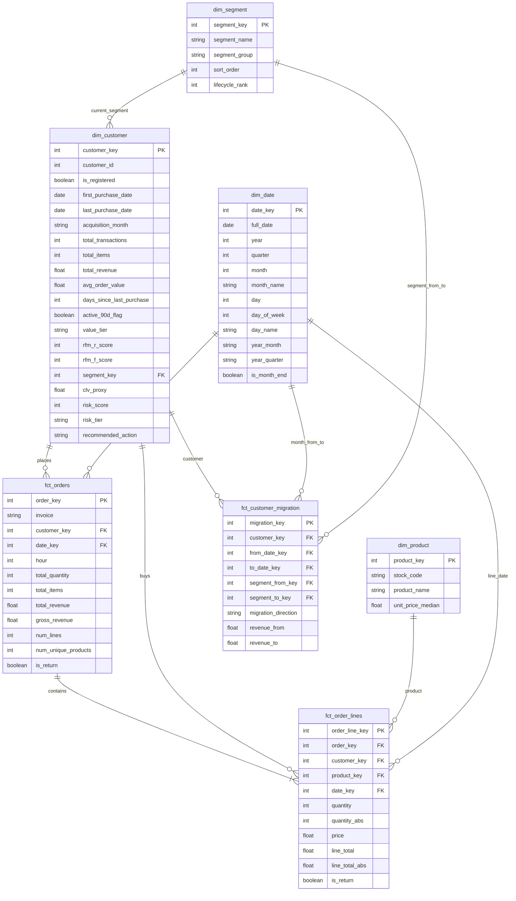

# 🏪 Retail360 — CRM & Customer Intelligence Analytics

Retail360 is a comprehensive end-to-end analytical project that transforms raw e-commerce transactional data into a production-ready, 3-page operational dashboard. The project demonstrates the full data lifecycle: from advanced cleaning and extraction (Python/Pandas) to building a dedicated Star Schema (Data Engineering) and professional visualization focused on driving specific business decisions (Power BI).

---

## 📊 Business Case & Project Rationale

### 🎯 Who is this for?
The primary users are **Heads of CRM**, **Customer Strategy Managers**, and **Account Managers**. This report is 100% **Customer-Centric**, prioritizing relationship health and long-term value over simple logistics or financial reporting.

### ❓ The Problem: "Analytical Myopia"
Many e-commerce businesses operate reactively, leading to:
*   **"Spray and Pray" Marketing:** Generic campaigns sent to the entire database (e.g., 5,000+ customers) without personalization.
*   **Budget Leakage:** Discounts being sent to "Champions" who would have purchased anyway.
*   **Silent Churn:** Ignoring "At Risk" customers until they have already transitioned to "Lost."
*   **Poor Resource Allocation:** Marketing teams guessing when to communicate and what products to offer.

### 💡 The Solution & Business Value
This dashboard shifts the organization from **reactive** to **proactive**. Instead of just reporting what happened, it tells managers **what to do next**. It enables precise RFM segmentation, automated Churn Risk scoring, and actionable recommendations that directly impact **Customer Lifetime Value (CLV)** and marketing ROI.

---

## 🖥️ Dashboard Architecture: From Insights to Action

The dashboard follows a logical flow: **STATUS → ALARM → ACTION**.

### 1. Health Check (Customer Base Vitality)
**Key Question:** *"What is the state of our customer base RIGHT NOW?"*
**Objective:** A 30-second situational overview to identify where the money is and find reasons for concern.

*   **Visuals:** KPI tiles showing active customer ratio and "Top 20% Revenue Share". Bar charts comparing volume vs. revenue structure.
*   **Business Decisions:** Assessing financial security and monitoring macro trends (growing vs. stagnating base).

### 2. Churn Risk (Revenue Salvation)
**Key Question:** *"Who are we losing RIGHT NOW and what is the cost?"*
**Objective:** An operational view to calculate the value of "money at risk" and trigger rescue actions.

*   **Visuals:** "Total CLV at Risk" tiles, "Risk Tier Distribution" (Healthy, Watchlist, Critical), and a drill-through table of specific customers.
*   **Business Decisions:** Prioritizing Account Manager workflows for "Win-back" campaigns.

### 3. Behavior & Patterns (Campaign Optimization)
**Key Question:** *"How should we target campaigns to maximize conversion?"*
**Objective:** Provide hard data for the Marketing Department.

*   **Visuals:** AOV and Return Rate analysis by segment, purchase heatmap (days/hours), and "Top Products" list.
*   **Business Decisions:** Scheduling targeted newsletters (e.g., Sunday 6:00 PM) based on segment behavior.

---

## ⚙️ ETL & Data Engineering

The data preparation process (found in `ETL.ipynb`) transforms raw transaction logs (UCI Online Retail II dataset, 2009-2011) into a clean, analytical Star Schema.

### 🧹 Cleaning & Extraction:
*   **Guest Handling:** Assigned `customer_id = 0` to unregistered users instead of deleting them (~23% of total sales).
*   **Noise Removal:** Filtered out operational non-sales entries (POSTAGE, test logs).
*   **Financial Standardization:** Flagged returns and unified product metadata.

### 🧪 Advanced Feature Engineering:
*   **RFM Segmentation:** Programmatic assignment to groups: *Champions, Loyal, Recent Buyers, Promising, At Risk, Lost*.
*   **Risk Score (0-100):** A custom scoring algorithm calculating churn probability based on segment, recency, and frequency.
*   **Automated Recommendations:** Automatically assigns recommended actions (e.g., *Upsell, Win-back, Personal Outreach*).

---

## 🗄️ Data Model (Star Schema)

High-performance schema optimized for the **VertiPaq** engine in Power BI. 

---

## 🛠️ Technology Stack

*   **Python 3.13:** Logic & ETL.
*   **Pandas & NumPy:** Data transformations.
*   **Jupyter Notebook:** Pipeline development.
*   **Power BI:** Visualization & DAX.
*   **Mermaid:** Architecture documentation.

---

## 🚀 Getting Started

1.  **Download Source Data:** Place `online_retail_II.xlsx` in the `data/raw/` folder.
2.  **Run ETL:** Execute the `ETL.ipynb` notebook to generate CSV tables in `star_schema/`.
3.  **Open Dashboard:** Load the Power BI (`.pbix`) file.
4.  **Refresh:** Point the data sources to your local CSV files and refresh.
