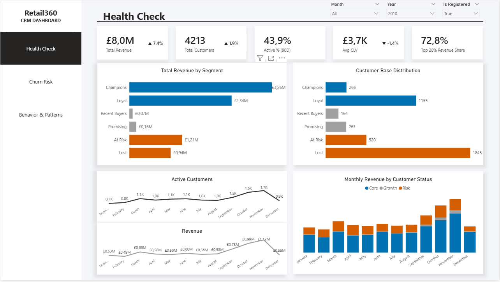
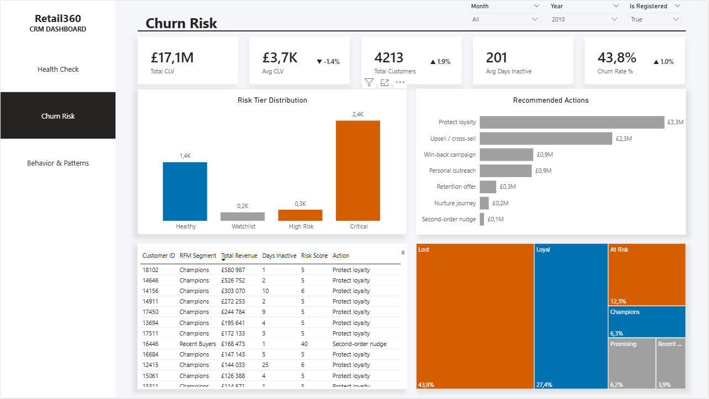
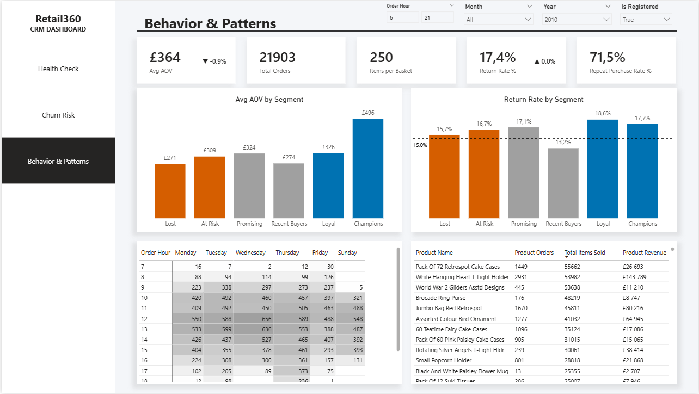

# 🏪 Retail360 — CRM & Customer Intelligence Analytics

[](README_PL.md)

Retail360 is an e-commerce analytics project encompassing the ETL process (Python/Pandas), the construction of a Star Schema model, and a visualization layer in the form of a 3-page operational dashboard in Power BI.

The data source for the project is the UCI Online Retail II dataset, containing transactional data from a UK-based e-commerce business offering gifts and homeware, covering the period from December 2009 to December 2011. During the ETL process, raw transactions were enriched with key customer analytics attributes, such as: RFM segmentation, a point-based Risk Score, CLV estimation, and automated CRM action recommendations.

---

## 📊 Business Context and Project Justification (Business Case)

The report is 100% Customer-Centric.

### 🎯 Who is this project for?
The main audience for the report is the **Head of CRM**, **Customer Strategy Manager**, and **Account Managers**.

### ❓ What problem are we solving?
* **Lack of personalization:** The company often sends generic campaigns to the entire database, which is inefficient.
* **Wasting budget:** Granting discounts to loyal customers who would have made a purchase anyway.
* **Silent Churn:** Ignoring at-risk customers until they permanently leave for the competition.
* **Poor resource allocation:** Marketing activities are undertaken without understanding the hourly and product patterns of individual segments.

### 💡 Solution and Business Value
The dashboard shifts the organization from a reactive to a proactive approach. Instead of looking at what has already happened, managers are provided with tools telling them what needs to be done right now. This enables precise segmentation (RFM), calculating the risk of churn (Risk Score), and automated action recommendations, which directly translates into saving revenue (Customer Lifetime Value) and optimizing marketing costs.

---

## 🖥️ Dashboard Architecture — What does the user read from the data?

The report is structured along a logical path: **STATUS** → **ALARM** → **ACTION**.

### 1. Health Check (Customer Base Health)
**Question:** *"What does our customer base look like NOW?"*
**Goal:** A 30-second, instant overview of database health and sales trends. The recipient immediately sees where the money is and whether there are any reasons for concern.
**Screen content:** Key financial and frequency KPIs. Charts contrasting the structure of generated revenues with the volume of customers in specific segments, alongside an analysis of monthly trends.



**Decision:** A comprehensive assessment of financial stability, allowing verification of which customer groups drive the monthly results, whether the company is overly dependent on the Champions segment, and how the long-term migration of the customer base is progressing.

### 2. Churn Risk (Risk of Leaving and Rescue Actions)
**Question:** *"Who are we losing NOW and how much is it costing us?"*
**Goal:** Identifying customers who require intervention.
* **Screen content:** KPIs for capital at risk (CLV) and Churn Rate. Risk distribution charts, a ranking of recommended actions, and a map of segment proportions. An operational table featuring a list of customers and their assigned rescue actions.



* **Business decisions:** Targeted, precise allocation of the retention budget (e.g., exclusive discounts, phone calls from sales reps) exclusively for customers with high CLV and a critical Risk Score.

### 3. Behavior & Patterns
**Question:** *"How should we target campaigns to maximize ROI?"*
**Goal:** Tactical optimization of marketing campaigns.
* **Screen content:** Interactive heatmap showing the distribution of orders over time (days of the week/hours) and a qualitative analysis of segments (Average Order Value – AOV, Return Rate). Additionally, a ranking of top products.




* **Business decisions:** Personalization of the communication schedule (e-mail/SMS) tailored to the activity peaks of a given segment, and designing effective marketing campaigns with dedicated recommendations based on what a specific group is most willing to buy.
  
---

## ⚙️ ETL Transformations (Data Engineering)

The data preparation process (saved in the `ETL.ipynb` file) transforms the raw dump from the transactional system into a Star Schema model.

### Key cleaning and transformation steps:
* **Guest Handling:** We assign `customer_id = 0` for unregistered users (analyzing ~23% of the database).
* **Noise Cleaning:** Operational transactions (POSTAGE, bank fees) were removed.
* **Financial standardization:** Returns were flagged and product names were standardized.

### Advanced Feature Engineering:
* **RFM:** Segmentation into groups: *Champions, Loyal, Recent Buyers, Promising, At Risk, Lost*.
* **Risk Score:** A point-based algorithm calculating the risk of churn.
* **Automated Recommendations:** Automatic assignment of recommended actions (e.g., *Upsell, Win-back*).

---

# 🗄️ Data Model (Star Schema)

```mermaid
erDiagram
    dim_date {
        int date_key PK
        date full_date
        int year
        int quarter
        int month
        string month_name
        int day
        int day_of_week
        string day_name
        string year_month
        string year_quarter
        boolean is_month_end
    }

    dim_segment {
        int segment_key PK
        string segment_name
        string segment_group
        int sort_order
        int lifecycle_rank
    }

    dim_customer {
        int customer_key PK
        int customer_id
        boolean is_registered
        date first_purchase_date
        date last_purchase_date
        string acquisition_month
        int total_transactions
        int total_items
        float total_revenue
        float avg_order_value
        int days_since_last_purchase
        boolean active_90d_flag
        string value_tier
        int rfm_r_score
        int rfm_f_score
        int segment_key FK
        float clv_proxy
        int risk_score
        string risk_tier
        string recommended_action
    }

    dim_product {
        int product_key PK
        string stock_code
        string product_name
        float unit_price_median
    }

    fct_orders {
        int order_key PK
        string invoice
        int customer_key FK
        int date_key FK
        int hour
        int total_quantity
        int total_items
        float total_revenue
        float gross_revenue
        int num_lines
        int num_unique_products
        boolean is_return
    }

    fct_order_lines {
        int order_line_key PK
        int order_key FK
        int customer_key FK
        int product_key FK
        int date_key FK
        int quantity
        int quantity_abs
        float price
        float line_total
        float line_total_abs
        boolean is_return
    }

    fct_customer_migration {
        int migration_key PK
        int customer_key FK
        int from_date_key FK
        int to_date_key FK
        int segment_from_key FK
        int segment_to_key FK
        string migration_direction
        float revenue_from
        float revenue_to
    }

    dim_segment ||--o{ dim_customer : current_segment
    dim_customer ||--o{ fct_orders : places
    dim_date ||--o{ fct_orders : order_date
    fct_orders ||--|{ fct_order_lines : contains
    dim_customer ||--o{ fct_order_lines : buys
    dim_product ||--o{ fct_order_lines : product
    dim_date ||--o{ fct_order_lines : line_date
    dim_customer ||--o{ fct_customer_migration : customer
    dim_date ||--o{ fct_customer_migration : month_from_to
    dim_segment ||--o{ fct_customer_migration : segment_from_to

---

## 🛠️ Technology Stack

*   **Python 3.13:** Logic & ETL.
*   **Pandas & NumPy:** Data transformations.
*   **Jupyter Notebook:** Pipeline development.
*   **Power BI:** Visualization & DAX.
*   **Mermaid:** Architecture documentation.

---

## 🚀 Getting Started

1.  **Download Source Data:** Place `online_retail_II.xlsx` in the `data/raw/` folder.
2.  **Run ETL:** Execute the `ETL.ipynb` notebook to generate CSV tables in `star_schema/`.
3.  **Open Dashboard:** Load the Power BI (`.pbix`) file.
4.  **Refresh:** Point the data sources to your local CSV files and refresh.
