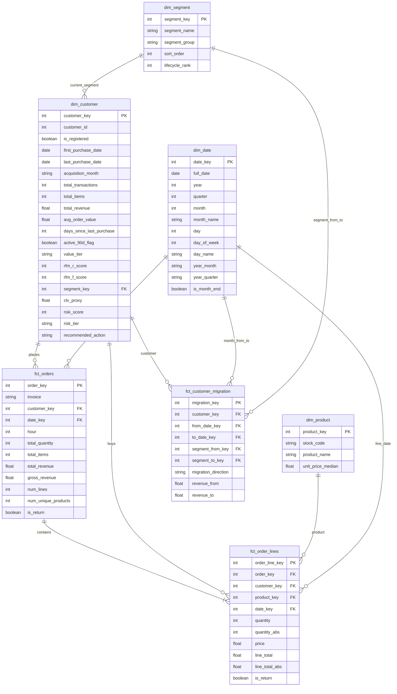

# 🏪 Retail360 — CRM & Customer Intelligence Analytics (PL)

Retail360 to analityczny projekt e-commerce obejmujący proces ETL (Python/Pandas), budowę modelu Star Schema oraz warstwę wizualizacyjną w postaci 3-stronicowego dashboardu operacyjnego w Power BI.

Źródłem danych dla projektu jest zestaw UCI Online Retail II, zawierający dane transakcyjne z brytyjskiego e-commerce oferującego upominki i dekoracje, obejmujący okres od grudnia 2009 do grudnia 2011 roku. W procesie ETL surowe transakcje wzbogacono o kluczowe atrybuty analityki klienckiej, takie jak: segmentacja RFM, punktowy wskaźnik ryzyka (Risk Score), estymacja CLV oraz zautomatyzowane rekomendacje działań CRM.
---

## 📊 Kontekst Biznesowy i Uzasadnienie Projektu (Business Case)

Raport jest w 100% zorientowany na analitykę kliencką (Customer-Centric).

### 🎯 Dla kogo jest ten projekt?
Głównym odbiorcą raportu jest **Head of CRM (Dyrektor ds. Relacji z Klientami)**, **Customer Strategy Manager** oraz **Account Managerzy**.

### ❓ Jaki problem rozwiązujemy?
*   **Brak personalizacji:** Firma często wysyła generyczne kampanie do całej bazy, co jest nieefektywne.
*   **Przepalanie budżetu:** Udzielanie rabatów lojalnym klientom, którzy i tak by kupili.
*   **Cichy Churn (Odejścia):** Ignorowanie klientów z grupy ryzyka do momentu, aż trwale odejdą do konkurencji.
*   **Zła alokacja zasobów:** Działania marketingowe podejmowane bez znajomości wzorców godzinowych i produktowych poszczególnych segmentów.

### 💡 Rozwiązanie i Wartość Biznesowa
Dashboard przesuwa organizację z podejścia reaktywnego na proaktywne. Zamiast patrzeć na to, co się wydarzyło, menedżerowie dostają narzędzia mówiące co należy teraz zrobić. Pozwala to na precyzyjną segmentację (RFM), wyliczanie ryzyka odejścia (Risk Score) i automatyczne rekomendacje akcji, co bezpośrednio przekłada się na ratowanie przychodów (Customer Lifetime Value) i optymalizację kosztów marketingu.

---

## 🖥️ Architektura Dashboardu — Co odbiorca czyta z danych?

Raport jest ułożony w logiczną ścieżkę: STATUS → ALARM → AKCJA.

### 1. Health Check (Zdrowie Bazy Klientów)
**Pytanie:** *"Jak wygląda nasza baza klientów TERAZ?"*
**Cel:** 30-sekundowy, błyskawiczny przegląd zdrowia bazy i trendów sprzedażowych. Odbiorca od razu widzi, gdzie leżą pieniądze i czy są powody do obaw.
**Zawartość ekranu** Kluczowe KPI finansowe i frekwencyjne. Wykresy zderzające strukturę generowanych przychodów z wolumenem klientów w poszczególnych segmentach oraz analiza trendów miesięcznych.
**Decyzja**: Kompleksowa ocena stabilności finansowej, pozwalająca zweryfikować z jakich grup klientów pochodzi miesięczny wynik, czy firma nie jest nadmiernie uzależniona od segmentu Champions oraz jak przebiega długoterminowa migracja bazy.

### 2. Churn Risk (Ryzyko Odejścia i Akcje Ratunkowe)
**Pytanie:** *"Kogo tracimy TERAZ i ile to nas kosztuje?"*
**Cel:** Identyfikacja klientów wymagających interwencji.
*   **Zawartość ekranu:** KPI zagrożonego kapitału (CLV) i wskaźnika odejść (Churn Rate). Wykresy dystrybucji ryzyka, ranking rekomendowanych akcji oraz mapa proporcji segmentów. Operacyjna tabela z listą klientów i przypisanymi działaniami ratunkowymi.
*   **Decyzje biznesowe:** Punktowa, precyzyjna alokacja budżetu ratunkowego (np. ekskluzywne rabaty, telefony od handlowców) wyłącznie dla klientów o wysokim CLV i krytycznym Risk Score.

### 3. Behavior & Patterns (Wzorce Behawioralne)
**Pytanie:** *"Jak targetować kampanie, aby zmaksymalizować ROI?"*
**Cel:** Optymalizacja taktyczna kampanii marketingowych.
*   **Zawartość ekranu** Interaktywna heatmapa rozkładu zamówień w czasie (dni tygodnia/godziny) oraz analiza jakościowa segmentów (Średnia Wartość Zamówienia – AOV, Wskaźnik Zwrotów). Dodatkowo ranking topowych produktów.
*   **Decyzje biznesowe:** Personalizacja harmonogramu komunikacji (e-mail/SMS) dopasowana do pików aktywności danego segmentu oraz projektowanie skutecznych kampanii marketingowych z dedykowanymi rekomendacjami, bazującymi na tym, co ta konkretna grupa kupuje najchętniej.
---

## ⚙️ Transformacje ETL (Data Engineering)

Proces przygotowania danych (zapisany w pliku `ETL.ipynb`) przekształca surowy zrzut z systemu transakcyjnego w model Star Schema.

### Kluczowe kroki czyszczenia i transformacji:
*   **Zarządzanie Gośćmi (Guest Handling):** Przypisujemy `customer_id = 0` dla niezarejestrowanych (analiza ~23% bazy).
*   **Oczyszczanie ze szumu:** Usunięto transakcje operacyjne (POSTAGE, opłaty bankowe).
*   **Standaryzacja finansowa:** Oflagowano zwroty i ujednolicono nazwy produktów.

### Zaawansowany Feature Engineering:
*   **RFM:** Segmentacja na grupy: *Champions, Loyal, Recent Buyers, Promising, At Risk, Lost*.
*   **Risk Score:** Algorytm punktowy wyliczający ryzyko odejścia.
*   **Automatyczne Rekomendacje:** Automatyczne przypisanie zalecanej akcji (np. *Upsell, Win-back*).

---

## 🗄️ Model Danych (Star Schema)

---

## 🛠️ Stack Technologiczny

*   **Python 3.13:** Główny język środowiska obliczeniowego.
*   **Pandas & NumPy:** Ekstrakcja, czyszczenie i kompleksowe transformacje na DataFrame'ach.
*   **Jupyter Notebook:** Interaktywne środowisko deweloperskie dla procesu ETL.
*   **Power BI:** Warstwa wizualizacji, modelowanie DAX, tworzenie interaktywnych dashboardów operacyjnych.

