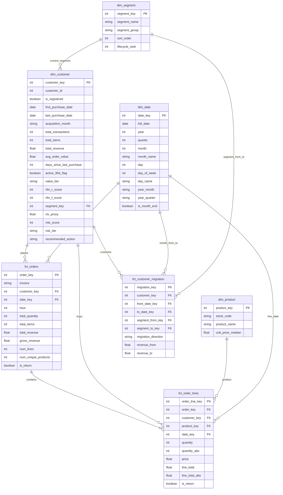

# 🏪 Retail360 — CRM & Customer Intelligence Analytics (PL)

Retail360 to kompleksowy projekt analityczny transformujący surowe dane transakcyjne e-commerce w gotowy do działania, 3-stronicowy dashboard operacyjny. Projekt demonstruje pełen cykl analityczny: od ekstrakcji i zaawansowanego czyszczenia danych (Python/Pandas), przez budowę dedykowanego modelu Star Schema (Data Engineering), aż po wizualizację ukierunkowaną na konkretne decyzje biznesowe (Power BI).

---

## 📊 Kontekst Biznesowy i Uzasadnienie Projektu (Business Case)

### 🎯 Dla kogo jest ten projekt?
Głównym odbiorcą raportu jest **Head of CRM (Dyrektor ds. Relacji z Klientami)**, **Customer Strategy Manager** oraz **Account Managerzy**. Raport jest w 100% zorientowany na klienta (Customer-Centric), a nie stricte na finanse czy logistykę.

### ❓ Jaki problem rozwiązujemy?
Wielu sprzedawców e-commerce cierpi na "analityczną krótkowzroczność" i działa w sposób reaktywny. Główne problemy to:
*   **Brak personalizacji ("Spray and Pray"):** Firma wysyła generyczne kampanie z rabatami do całej bazy (np. 5000 klientów).
*   **Przepalanie budżetu:** Zniżki trafiają do segmentu "Champions", którzy i tak by kupili bez zachęty.
*   **Cichy Churn (Odejścia):** Firma ignoruje segment "At Risk" do momentu, aż klienci trwale odejdą do konkurencji (stając się segmentem "Lost").
*   **Zła alokacja zasobów:** Dział marketingu strzela w ciemno, nie wiedząc, o jakiej porze komunikować się z poszczególnymi profilami ani co im zaoferować.

### 💡 Rozwiązanie i Wartość Biznesowa
Dashboard przesuwa organizację z podejścia reaktywnego na proaktywne. Zamiast patrzeć na to, co się wydarzyło, menedżerowie dostają narzędzia mówiące co należy teraz zrobić. Pozwala to na precyzyjną segmentację (RFM), wyliczanie ryzyka odejścia (Risk Score) i automatyczne rekomendacje akcji, co bezpośrednio przekłada się na ratowanie przychodów (Customer Lifetime Value) i optymalizację kosztów marketingu.

---

## 🖥️ Architektura Dashboardu — Co odbiorca czyta z danych?

Dashboard składa się z 3 logicznie połączonych stron, prowadzających użytkownika od ogółu do konkretnej akcji: **STATUS → ALARM → AKCJA**.

### 1. Health Check (Zdrowie Bazy Klientów)
**Pytanie:** *"Jak wygląda nasza baza klientów TERAZ?"*
**Cel:** 30-sekundowy przegląd sytuacji — gdzie leżą pieniądze i czy są powody do obaw.

*   **Visuals:** Kafelki KPI (odsetek aktywnych klientów, Top 20% Revenue Share). Wykresy słupkowe zderzające strukturę wolumenową z przychodową.
*   **Decyzje biznesowe:** Ocena bezpieczeństwa finansowego i monitorowanie makro-trendów.

### 2. Churn Risk (Ryzyko Odejścia i Akcje Ratunkowe)
**Pytanie:** *"Kogo tracimy TERAZ i ile to nas kosztuje?"*
**Cel:** Strona stricte operacyjna, wyliczająca wartość zagrożonych pieniędzy.

*   **Visuals:** Total CLV at Risk, "Risk Tier Distribution" (Healthy, Watchlist, Critical) oraz szczegółowa tabela klientów.
*   **Decyzje biznesowe:** Priorytetyzacja pracy Account Managerów i telefonów ratunkowych.

### 3. Behavior & Patterns (Wzorce Behawioralne)
**Pytanie:** *"Jak targetować kampanie, aby zmaksymalizować konwersję?"*
**Cel:** Dostarcza twardych danych dla działu marketingu.

*   **Visuals:** Analiza AOV i Return Rate, macierz (Heatmap) dni i godzin zakupów oraz tabela "Top Products".
*   **Decyzje biznesowe:** Optymalizacja czasu wysyłki newsletterów i dobór asortymentu pod segmenty.

---

## ⚙️ Transformacje ETL (Data Engineering)

Proces przygotowania danych (zapisany w pliku `ETL.ipynb`) przekształca surowy zrzut z systemu transakcyjnego w model Star Schema.

### Kluczowe kroki czyszczenia i transformacji:
*   **Zarządzanie Gośćmi (Guest Handling):** Przypisujemy `customer_id = 0` dla niezarejestrowanych (analiza ~23% bazy).
*   **Oczyszczanie ze szumu:** Usunięto transakcje operacyjne (POSTAGE, opłaty bankowe).
*   **Standaryzacja finansowa:** Oflagowano zwroty i ujednolicono nazwy produktów.

### Zaawansowany Feature Engineering:
*   **RFM:** Segmentacja na grupy: *Champions, Loyal, Recent Buyers, Promising, At Risk, Lost*.
*   **Risk Score:** Algorytm punktowy wyliczający ryzyko odejścia.
*   **Automatyczne Rekomendacje:** Automatyczne przypisanie zalecanej akcji (np. *Upsell, Win-back*).

---

## 🗄️ Model Danych (Star Schema)

> 🔗 **Zobacz szczegółową [Dokumentację i Diagram Bazy Danych](SCHEMA_DIAGRAM.md)**

---

## 🛠️ Stack Technologiczny

*   **Python 3.13:** Główny język środowiska obliczeniowego.
*   **Pandas & NumPy:** Ekstrakcja, czyszczenie i kompleksowe transformacje na DataFrame'ach.
*   **Jupyter Notebook:** Interaktywne środowisko deweloperskie dla procesu ETL.
*   **Power BI:** Warstwa wizualizacji, modelowanie DAX, tworzenie interaktywnych dashboardów operacyjnych.
*   **Mermaid:** Dokumentacja schematu bazy danych.

---

## 🚀 Jak uruchomić projekt?

1.  **Pobierz dane źródłowe:** Umieść `online_retail_II.xlsx` w folderze `data/raw/`.
2.  **Uruchom notatnik:** Otwórz i wykonaj wszystkie komórki w `ETL.ipynb`.
3.  **Otwórz dashboard:** Otwórz plik Power BI (`.pbix`).
4.  **Odśwież dane:** Wskaż lokalizację nowo wygenerowanych plików CSV i odśwież model.
